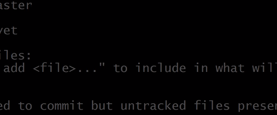

# Github 특강 - Basic

## Git이란?

Git은 파일의 버전관리를 해주는 곳, 사진 혹은 문서가 모여있는 스마트한 폴더라고 설명할 수 있다. 

### 버전관리란?

버전관리란 파일이 시간이 지남에 따라 기록했다가 나중의 특정 시점의 버전을 다시 꺼내올 수 있도록 하는 것을 말한다. 


## git 사용법

### 최초 설정

처음 컴퓨터에 git을 설치하면, 사용자의 이메일과 이름을 적어준다. 이는 앞으로 일어나는 커밋에 서명을 하기 위해 필요하다.

```
git config --global user.name"<당신의 이름>''

git config --global user.email"<당신의 이메일>"
```


#### 초기화 

### Stage 올리기

### Commit 하기



``` 
윈도우 쉬프트 S
```

## Summary

| 명령어   | 설명                |
| -------- | ------------------- |
| git init | 빈 디렉토리(폴더)를 |
| git add  |                     |


# Github 특강 - Basic

## git 이란?


## git 설치

1. git-scm.com 에서 다운로드
2. 계속 next 로 설치


## git 사용법

### 최초 설정

처음 컴퓨터에 git을 설치하면, 사용자의 이메일과 이름을 적어준다. 이는 앞으로 일어나는 커밋에 서명을 하기 위해서 필요하다.

```
$ git config --global user.name "<당신의 이름>"

$ git config --global user.email "<당신의>@<이메일>"
```

잘 설정되었나 확인하려면

```
$ git config user.name
이름 출력

$ git config user.email
이메일 출력
```


### 상태 점검


### 초기화

초기화는 `git init` 을 통해 진행한다.

```
$ git init
```


### add하기


### Commit 하기


### Log 보기


## Summary

| 명령어 | 설명 |
| ------ | ---- |
|        |      |
| ---------------------------------- | --------------------------------------------------- |
| ---------------------------------- | --------------------------------------------------- |
|                                    |                                                     |
| `$ git init` | 빈 디렉토리(폴더)를 git 저장소(repo)로 초기화 한다. |
| ------------ | --------------------------------------------------- |
|              |                                                     |
| `$ git add <filename>` | `<filename>`을 Stage 에 올린다. |
| ---------------------- | ------------------------------- |
|                        |                                 |
| `$ git commit -m "commit message"` |      |
| ---------------------------------- | ---- |
|                                    |      |


